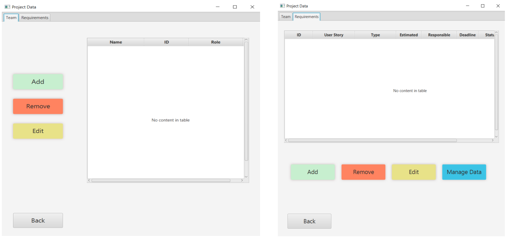

# Project Management System

ColorIT Project Management System represents the 1st-semester project for the Software Technology Engineering programme at VIA University College. The project depicts a Java stand-alone application with a JavaFX GUI for managing a company's internal project development, including tasks and requirements handling as well as team members and role administration. In addition, a responsive [website](https://liacicati.github.io/project-management-system/Website/)  was created to provide customers with web access to track the status of their projects.